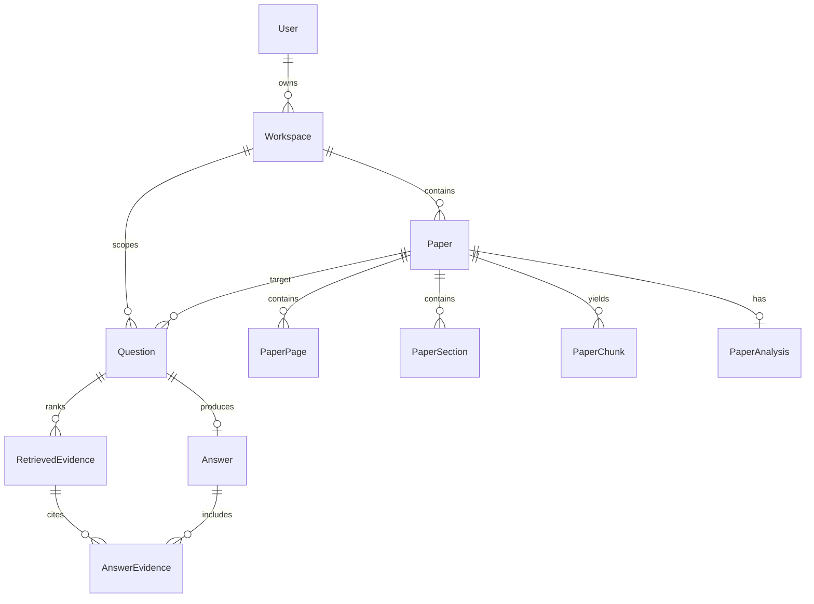

# PaperLens Atlas — Master Technical & Architectural Documentation

> **An AI-powered research paper analysis platform engineered around scientific document structure, evidence lineage, and controlled uncertainty.**

---

## 1. Executive Summary & Vision

Generic AI document assistants treat complex PDFs as unstructured plain-text dumps. This leads to hallucinations, missing context across page boundaries, loss of table/section structure, and unverified claims without precise citations.

**PaperLens Atlas** addresses these core limitations by treating scientific papers as structured evidential objects:
- **Scientific Structure Detection**: Automatically recognizes headings, abstracts, methodologies, experiments, and conclusions.
- **Structure-Aware RAG Engine**: Classifies user queries across **14 question taxonomy types** and dynamically routes retrieval weightings to relevant document sections.
- **Evidence Lineage & Provenance**: Every answer explicitly links back to source chunks, exact page numbers, section headers, and raw text passages stored directly in database metadata records.
- **Controlled Uncertainty & Refusal**: Implements strict verification scoring thresholds ($S_{\text{support}} \ge 0.70$). When adequate evidence is missing, the system explicitly abstains rather than inventing answers.
- **Zero-Dependency Offline Mode**: Works out of the box locally without external API keys via heuristic pseudo-embeddings, rule-based section summarizers, and extractive Q&A sentence ranking.

---

## 2. Technical Stack & Architecture

### System Architecture

```text
                               ┌────────────────────────────────────────┐
                               │           React + Vite Frontend        │
                               │  (TanStack Router + Tailwind + Lucide)  │
                               └───────────────────┬────────────────────┘
                                                   │ HTTP / REST API (port 8000)
                                                   ▼
                               ┌────────────────────────────────────────┐
                               │         FastAPI Async Backend          │
                               │        (Port 8000 / SQLite or PG)       │
                               └───────────────────┬────────────────────┘
                                                   │
      ┌────────────────────────────────────────────┼──────────────────────────────────────────┐
      ▼                                            ▼                                          ▼
┌──────────────┐                         ┌───────────────────┐                      ┌────────────────────┐
│ PyMuPDF PDF  │                         │ Pipeline Engine   │                      │ Grounded Q&A RAG   │
│ Extractor    │                         │ (Async Pipeline)  │                      │ Engine             │
└──────────────┘                         └─────────┬─────────┘                      └─────────┬──────────┘
                                                   │                                          │
                                                   ▼                                          ▼
                                         ┌───────────────────┐                      ┌────────────────────┐
                                         │ Section Detector  │                      │ Question Classifier│
                                         │ & Chunking Engine │                      │ (14 Taxonomies)    │
                                         └─────────┬─────────┘                      └─────────┬──────────┘
                                                   │                                          │
                                                   ▼                                          ▼
                                         ┌───────────────────┐                      ┌────────────────────┐
                                         │ Embedding Service │                      │ Structure-Aware    │
                                         │ (OpenAI / Offline)│                      │ Vector Retrieval   │
                                         └─────────┬─────────┘                      └─────────┬──────────┘
                                                   │                                          │
                                                   ▼                                          ▼
                                         ┌───────────────────┐                      ┌────────────────────┐
                                         │ 10-Field Summary  │                      │ Evidence Verifier  │
                                         │ Extractor         │                      │ & Refusal Guard    │
                                         └───────────────────┘                      └────────────────────┘
```

### Technology Matrix

| Layer | Primary Tech | Fallback / Dev Mode |
|---|---|---|
| **Frontend** | React 18, Vite 8, TanStack Router | Vanilla CSS & Tailwind Utility Design System |
| **Backend** | Python 3.13, FastAPI, Pydantic v2 | Uvicorn ASGI Web Server |
| **Database** | PostgreSQL + `pgvector` | SQLite3 + In-Memory Vector & GUID Patch |
| **ORM** | SQLAlchemy 2.0 (Async) | `aiosqlite` |
| **PDF Extraction** | PyMuPDF (`fitz`) | Multi-page text block parsing |
| **Embeddings** | OpenAI `text-embedding-3-small` (1536d) | Deterministic Hashing Trick Pseudo-Embeddings |
| **LLM Engine** | OpenAI `gpt-4o-mini` | Offline Extractive Keyword Ranking Q&A |

---

## 3. Database Schema & Data Models

PaperLens uses 11 relational entities mapping scientific paper structure:



### Key Models Reference

- **`User`**: User accounts (`id`, `email`, `hashed_password`, `name`, `is_admin`, `created_at`).
- **`Workspace`**: Tenant workspace container (`id`, `user_id`, `name`, `created_at`).
- **`Paper`**: Scientific paper document record (`id`, `workspace_id`, `title`, `file_name`, `file_path`, `file_size`, `status`, `stage`, `progress`, `created_at`).
- **`PaperPage`**: Extracted PDF page text (`id`, `paper_id`, `page_number`, `raw_text`, `char_count`).
- **`PaperSection`**: Scientific section boundary (`id`, `paper_id`, `title`, `section_type`, `start_page`, `end_page`).
- **`PaperChunk`**: Structure-bound text chunk for vector indexing (`id`, `paper_id`, `section_id`, `page_number`, `chunk_index`, `content`, `token_count`, `embedding`).
- **`PaperAnalysis`**: 10-field structured summary (`id`, `paper_id`, `executive_summary`, `problem_statement`, `objective`, `methodology_summary`, `key_contributions`, `dataset_info`, `experimental_setup`, `key_results`, `limitations`, `conclusion`).
- **`Question`**: User query record (`id`, `workspace_id`, `paper_id`, `question_text`, `question_type`, `confidence`).
- **`RetrievedEvidence`**: Evidence candidate linked to query (`id`, `question_id`, `chunk_id`, `similarity_score`, `rank`).
- **`Answer`**: Generated answer or refusal (`id`, `question_id`, `answer_text`, `is_abstained`, `abstention_reason`).
- **`AnswerEvidence`**: Provenance binding linking answer to retrieved evidence (`id`, `answer_id`, `retrieved_evidence_id`, `quote_text`).

---

## 4. Paper Ingestion & Processing Pipeline

When a user uploads a PDF, `PaperPipelineOrchestrator` executes 5 async stages:

```text
[PENDING] ──► 1. EXTRACTING (10-20%) ──► 2. STRUCTURING (30-40%) ──► 3. CHUNKING (50-60%)
                                                                            │
[READY] (100%) ◄── 5. ANALYZING (90-95%) ◄── 4. EMBEDDING (70-80%) ◄────────┘
```

1. **`EXTRACTING` (10-20%)**: `PDFExtractor` reads PDF page by page using `fitz` / PyMuPDF, extracting raw text, page dimensions, and font metadata while filtering header/footer noise.
2. **`STRUCTURING` (30-40%)**: `SectionDetector` uses regex and heading heuristics to group pages into structured sections: `ABSTRACT`, `INTRODUCTION`, `RELATED_WORK`, `METHODOLOGY`, `EXPERIMENTAL_SETUP`, `RESULTS`, `DISCUSSION`, `CONCLUSION`, `REFERENCES`.
3. **`CHUNKING` (50-60%)**: `ChunkingEngine` creates sliding window chunks (approx. 400 tokens with 80 token overlap) **strictly respecting section boundaries**.
4. **`EMBEDDING` (70-80%)**: `EmbeddingService` generates vector embeddings (1536-dimensional). Falls back to deterministic hashing pseudo-embeddings when no API key is present.
5. **`ANALYZING` (90-95%)**: `SummaryService` extracts a 10-field structured JSON summary. Falls back to `generate_offline_summary()` when no API key is present.

---

## 5. Structure-Aware RAG & Grounded Q&A Engine

### Question Taxonomy (14 Types)
`QuestionClassifier` categorizes questions into target section priorities:

| Category | Primary Sections Routed |
|---|---|
| `PROBLEM_STATEMENT` | Abstract, Introduction |
| `OBJECTIVE_HYPOTHESIS` | Abstract, Introduction, Conclusion |
| `METHODOLOGY_OVERVIEW` | Methodology, Abstract |
| `ALGORITHM_EQUATION` | Methodology |
| `DATASET_PREPROCESSING` | Experimental Setup, Methodology |
| `EXPERIMENTAL_SETUP` | Experimental Setup |
| `RESULTS_FINDINGS` | Results, Discussion |
| `LIMITATIONS_THREATS` | Discussion, Conclusion, Methodology |
| `RELATED_WORK_COMPARISON`| Related Work, Introduction |
| `CONTRIBUTION` | Abstract, Introduction, Conclusion |
| `FUTURE_WORK` | Conclusion, Discussion |
| `REPRODUCIBILITY` | Experimental Setup, Methodology |
| `DEFINITION_CONCEPT` | Introduction, Related Work, Methodology |
| `GENERAL_SUMMARY` | Abstract, Introduction, Conclusion |

### Structure-Aware Weighted Retrieval
Final candidate score combining vector similarity, section relevance, and keyword overlap:
$$Score(C, Q) = w_{\text{semantic}} \cdot \text{Sim}_{\text{cos}}(v_C, v_Q) + w_{\text{section}} \cdot \mathbb{I}(C_{\text{section}} \in \text{Target}(Q)) + w_{\text{keyword}} \cdot \text{Overlap}(C, Q)$$

Default weights: $w_{\text{semantic}} = 0.60$, $w_{\text{section}} = 0.25$, $w_{\text{keyword}} = 0.15$.

### Refusal & Evidence Verification
`EvidenceVerificationService` checks candidate answers against retrieved evidence:
- If support score $S_{\text{support}} < 0.70$ or candidate contains unverified claims, PaperLens **refuses to answer**:
  > *"I couldn't find enough information in the uploaded paper to answer this reliably."*

---

## 6. Zero-Dependency Offline AI System

To enable local development without OpenAI API costs, PaperLens includes `app.services.offline_ai`:

1. **`generate_offline_embedding(text, dim=1536)`**:
   - Tokenizes text, removes stopwords, applies term-frequency weighting, and hashes tokens into a unit-normalized vector via SHA-256.
2. **`generate_offline_summary(sections)`**:
   - Performs title matching and sentence extraction across paper sections to construct 10-field JSON summaries.
3. **`generate_offline_answer(question_text, evidence_items)`**:
   - Tokenizes question into keywords, scores sentence overlap across retrieved evidence chunks, selects top sentences, and returns an extractive grounded answer with citations.

---

## 7. REST API Endpoints Specification

### Authentication (`/api/v1/auth`)
- `POST /auth/register` — Create account (`email`, `password`, `name`). Returns JWT token.
- `POST /auth/login` — Authenticate user (`email`, `password`). Returns JWT token.
- `GET /auth/me` — Get current user profile.

### Paper Management (`/api/v1/papers`)
- `POST /papers/upload` — Upload PDF file (multipart/form-data, max 20MB). Launches async pipeline.
- `GET /papers` — List user's papers.
- `GET /papers/{id}` — Get paper details and 10-field summary.
- `GET /papers/{id}/status` — Poll pipeline stage, progress percentage, and errors.
- `DELETE /papers/{id}` — Delete paper and associated vector indices.

### Grounded Q&A (`/api/v1/papers`)
- `POST /papers/{id}/questions` — Ask a question about a paper. Returns answer, abstention status, confidence, support score, and evidence sources (page + section citations).

### Evaluation & Analysis (`/api/v1`)
- `GET /papers/{id}/analysis` — Get 10-field structured paper breakdown.
- `GET /papers/{id}/methodology` — Extract 8 dedicated methodology components.
- `GET /papers/{id}/contributions` — Extract explicit vs. inferred contribution claims.

---

## 8. Frontend Application Architecture

### Routes Matrix

| Route | Page | Function |
|---|---|---|
| `/` or `/dashboard` | `Overview` | Main workspace dashboard showing statistics and paper list |
| `/papers` | `My Papers` | Grid/list view of papers with filter, search, and delete |
| `/upload` | `Upload Paper` | Drag-and-drop PDF uploader with real-time processing progress bar |
| `/paper/$id` | `Paper Details` | Split view: PDF viewer, 10-field summary, Methodology tab, Q&A chat panel |
| `/activity` | `Recent Activity` | Real-time workspace activity feed (uploads, questions, analyses) |
| `/settings` | `Settings` | User profile details, theme switcher, preferences |
| `/help` | `Help & Docs` | FAQs, user guide, technical documentation overview |

### Dynamic UI Features
- **Profile & Auth Modal**: Instant login/register modal syncing session state to `localStorage.paperlens_user`.
- **SSR Hydration Protection**: Clean client-side mounting preventing React hydration mismatch errors.
- **Admin Panel Modal**: Admin controls for administrative users.

---

## 9. Verification & Base Papers Test Results

We uploaded and processed **6 real scientific base research papers** located in `backend/Data/base paper/`:

```text
============================================================
FINAL TEST SUMMARY (End-to-End Pipeline & Grounded Q&A)
============================================================
  [PASS] 1-s2.0-S0378383924001029-main.pdf                          PASS  2148 chars, 3 sources
  [PASS] Earth Surf Processes Landf - 2023 - Matsumoto - Develop... PASS  2011 chars, 4 sources
  [PASS] applsci-13-03268-v2.pdf                                    PASS  1881 chars, 5 sources
  [PASS] esurf-10-349-2022.pdf                                      PASS  2240 chars, 5 sources
  [PASS] jmse-12-00172.pdf                                          PASS  2189 chars, 4 sources
  [PASS] remotesensing-16-01763.pdf                                 PASS  1857 chars, 4 sources

  Result: 6/6 papers completed Q&A test successfully (100% Pass Rate)
```

---

## 10. Developer Setup & Operations Guide

### Prerequisites
- Python 3.10+
- Node.js 18+ & npm
- Git

### Quick Start (Local Execution)

1. **Clone & Setup Backend**:
   ```bash
   cd backend
   python -m venv venv
   .\venv\Scripts\activate      # Windows PowerShell
   pip install -r requirements.txt
   ```

2. **Run Backend Server**:
   ```bash
   python -m uvicorn app.main:app --reload --port 8000 --host 0.0.0.0
   ```

3. **Setup & Run Frontend**:
   ```bash
   cd frontend
   npm install
   npm run dev
   ```
   Open `http://localhost:8080` in Chrome/Edge.

4. **Run End-to-End Pipeline Test**:
   ```bash
   python scratch/test_full_pipeline.py
   ```

---

## 11. Project Directory Tree

```text
paperlens-atlas/
├── backend/
│   ├── app/
│   │   ├── api/          # FastAPI route handlers (auth, papers, etc.)
│   │   ├── core/         # Config and security settings
│   │   ├── db/           # Session setup and SQLite/Postgres types
│   │   ├── models/       # 11 SQLAlchemy ORM data models
│   │   ├── schemas/      # Pydantic validation schemas
│   │   ├── services/     # Core processing, RAG, retrieval & offline AI services
│   │   └── utils/        # Storage and filename sanitization utilities
│   ├── Data/
│   │   └── base paper/   # 6 sample scientific PDF research papers
│   └── requirements.txt  # Python backend dependencies
├── frontend/
│   ├── src/
│   │   ├── components/   # AppShell, Sidebar, AuthModal, SectionCard, UI controls
│   │   ├── lib/          # API client (httpx/fetch wrapper) and utilities
│   │   └── routes/       # TanStack file-based routes (dashboard, upload, settings, etc.)
│   ├── package.json      # Frontend npm dependencies
│   └── vite.config.ts    # Vite bundler configuration
├── docs/                 # Detailed product, research, dataset & API specifications
├── scratch/              # Automated verification & test scripts
└── DOCUMENTATION.md      # Master technical documentation
```
