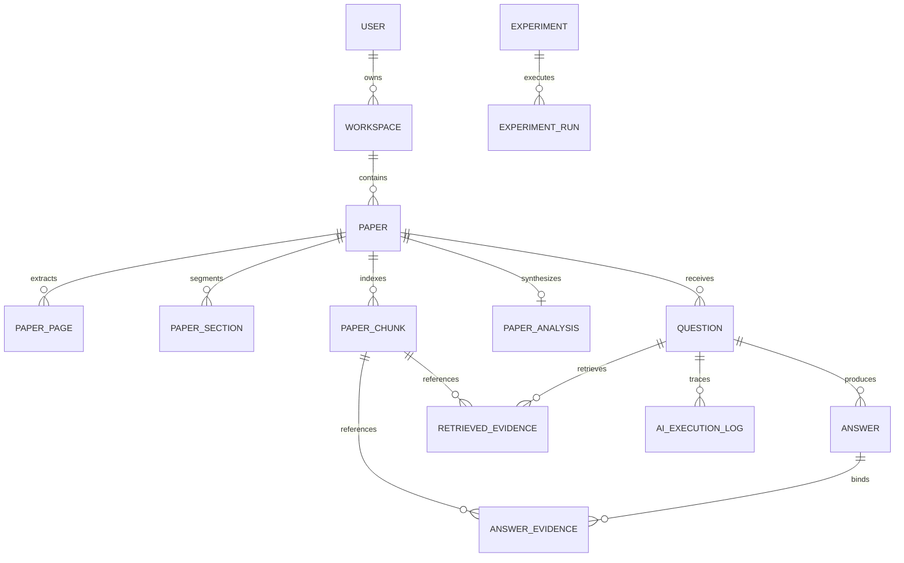

# PaperLens Atlas

### Evidence-Grounded Scientific Document Intelligence Platform

[](https://fastapi.tiangolo.com)
[](https://react.dev)
[](https://www.typescriptlang.org)
[](https://tailwindcss.com)
[](https://www.python.org)
[](https://www.sqlalchemy.org)
[](https://github.com/pgvector/pgvector)
[](https://pymupdf.readthedocs.io/)
[](https://github.com/maxbachmann/RapidFuzz)
[](https://github.com/dorianbrown/rank_bm25)
[](https://slowapi.readthedocs.io/)
[](https://www.docker.com/)

> **Understand research papers. Ask questions. Follow the evidence.**

---

## 📑 Table of Contents

- [1. Executive Overview](#1-executive-overview)
  - [The Problem with Generic RAG on Scientific Literature](#the-problem-with-generic-rag-on-scientific-literature)
  - [The PaperLens Solution](#the-paperlens-solution)
- [2. System Architecture & Modular Subsystems](#2-system-architecture--modular-subsystems)
  - [Architectural Topology](#architectural-topology)
  - [Modular Domain Subpackages](#modular-domain-subpackages)
  - [Scientific Ingestion Pipeline](#scientific-ingestion-pipeline)
  - [Structure-Aware Grounded Q&A Pipeline](#structure-aware-grounded-qa-pipeline)
- [3. AI Engine & Fallback Architecture](#3-ai-engine--fallback-architecture)
  - [Local-First AI Engine (Primary)](#local-first-ai-engine-primary)
  - [Confidence-Aware Gemini Fallback (Secondary)](#confidence-aware-gemini-fallback-secondary)
  - [Authoritative Database Provenance Principle](#authoritative-database-provenance-principle)
- [4. Core Technical Innovations & RAG Mechanics](#4-core-technical-innovations--rag-mechanics)
  - [Structure-Aware Chunking & Section Taxonomy](#structure-aware-chunking--section-taxonomy)
  - [Question Intent Routing (14 Taxonomies)](#question-intent-routing-14-taxonomies)
  - [Hybrid Retrieval Scoring (BM25 + Semantic + Section Boost)](#hybrid-retrieval-scoring-bm25--semantic--section-boost)
  - [Citation Provenance & RapidFuzz Quote Verification](#citation-provenance--rapidfuzz-quote-verification)
  - [Controlled Uncertainty & Safe Abstention](#controlled-uncertainty--safe-abstention)
- [5. Security, Isolation & Durability Hardening](#5-security-isolation--durability-hardening)
  - [Cookie-Based Authentication & Session Hydration](#cookie-based-authentication--session-hydration)
  - [Systematic Anti-IDOR Workspace Isolation (404 Not Found)](#systematic-anti-idor-workspace-isolation-404-not-found)
  - [PDF Prompt Injection Defense](#pdf-prompt-injection-defense)
  - [Sliding-Window Rate Limiting (Slowapi)](#sliding-window-rate-limiting-slowapi)
  - [Pipeline Durability & Automatic Reconciler](#pipeline-durability--automatic-reconciler)
- [6. Database Architecture (16 Relational Models)](#6-database-architecture-16-relational-models)
- [7. Benchmark Framework (QASPER 3-Way RAG Comparison)](#7-benchmark-framework-qasper-3-way-rag-comparison)
- [8. Base Research Papers & Verified Evaluation](#8-base-research-papers--verified-evaluation)
- [9. Complete REST API Reference](#9-complete-rest-api-reference)
- [10. Frontend Application Feature Tour](#10-frontend-application-feature-tour)
- [11. Repository File Structure](#11-repository-file-structure)
- [12. Quick Start & Local Setup](#12-quick-start--local-setup)
  - [Prerequisites](#prerequisites)
  - [1-Click Offline Launcher (PowerShell)](#1-click-offline-launcher-powershell)
  - [Docker Compose Multi-Container Setup](#docker-compose-multi-container-setup)
  - [Manual Backend Installation](#manual-backend-installation)
  - [Manual Frontend Installation](#manual-frontend-installation)
  - [Environment Variables Configuration](#environment-variables-configuration)
  - [Running Test Suites](#running-test-suites)
- [13. Technical Documentation Sitemap](#13-technical-documentation-sitemap)
- [14. License](#14-license)

---

## 1. Executive Overview

PaperLens Atlas is an evidence-grounded scientific document intelligence platform engineered specifically for students, researchers, engineers, and academics.

### The Problem with Generic RAG on Scientific Literature

Standard RAG tools treat PDF files as flat, unstructured text dumps. They slice documents into uniform fixed-character sliding windows, generate vector embeddings, and execute naive nearest-neighbor search. This results in three critical failure modes:

1. **Loss of Structural Context**: Generic RAG treats text from `Related Work` identically to text from `Methodology` or `Results`. A query such as *"What dataset was evaluated?"* routinely retrieves prior datasets discussed in historical literature surveys rather than the paper's actual contribution.
2. **Citation Hallucinations**: Standard LLMs asked to output page numbers or section references routinely fabricate plausible citations because they lack direct binding to database provenance records.
3. **Over-Confidence & False Answering**: Generic RAG systems attempt to answer every question even when the uploaded document contains zero relevant evidence (e.g., answering financial stock questions against a coastal oceanography paper).

### The PaperLens Solution

PaperLens is built on the foundational principle:

$$\textbf{An answer is only as useful as the evidence supporting it.}$$

- **Structure-Aware Taxonomy**: Automatically detects and preserves 12 scientific section types and 14 question intent classifications.
- **Hybrid Retrieval**: Blends dense semantic vector embeddings, normalized **BM25 Okapi** keyword scoring, and section taxonomy priority routing.
- **Database Provenance Binding**: Citation metadata (`page_number`, `section_title`, `chunk_id`) is strictly bound to database rows, eliminating LLM citation fabrications.
- **RapidFuzz Quote Verification**: Every cited quote is checked against source text using exact substring matching and `RapidFuzz` ($S_{\text{match}} \ge 90$). Fabricated quotes are dropped before database persistence.
- **Explicit Abstention Guard**: If the computed support score falls below threshold ($S_{\text{support}} < 0.70$) or if no verifiable citations survive, PaperLens safely refuses:
  > *"I couldn't find enough information in the uploaded paper to answer this reliably."*
- **Local-First with Confidence-Aware Gemini Fallback**: Uses local offline AI for primary generation and invokes Google Gemini only when local confidence or completeness falls below threshold.

---

## 2. System Architecture & Modular Subsystems

### Architectural Topology

```text
                               ┌────────────────────────────────────────┐
                               │           React 19 Frontend            │
                               │  (TanStack Router + Tailwind v4 + Lucide)│
                               └───────────────────┬────────────────────┘
                                                   │ HTTP / REST API (Port 8000)
                                                   │ Credentials: Cookie / Header
                                                   ▼
                               ┌────────────────────────────────────────┐
                               │         FastAPI Async Backend          │
                               │   (Slowapi Limiter + Auth + Deps)      │
                               └───────────────────┬────────────────────┘
                                                   │
       ┌───────────────────┬───────────────────────┼───────────────────────┬───────────────────┐
       ▼                   ▼                       ▼                       ▼                   ▼
┌──────────────┐  ┌──────────────────┐   ┌───────────────────┐   ┌───────────────────┐  ┌─────────────┐
│ app/document │  │ app/retrieval    │   │ app/ai (Router)   │   │ app/evidence      │  │ app/jobs    │
│  - Extractor │  │  - DenseRetriever│   │  - LocalProvider  │   │  - Selector       │  │  - Queue    │
│  - SectionDet│  │  - BM25Retriever │   │  - GeminiProvider │   │  - Verifier       │  │  - Worker   │
│  - Chunker   │  │  - SectionRouter │   │  - FallbackPolicy │   │  - SupportEval    │  │  - Reconcile│
│  - Sanitizer │  │  - HybridScorer  │   │  - PromptSafety   │   │  - CitationAssm   │  │  - Tasks    │
└──────────────┘  └──────────────────┘   └───────────────────┘   └───────────────────┘  └─────────────┘
```

### Modular Domain Subpackages

The backend (`backend/app/`) is architected into clean, typed, modular domain subpackages:

1. **`app/retrieval/`**: `DenseRetriever`, `BM25Retriever`, `SectionRouter`, `HybridScorer`, `IdentityReranker`, `HybridRetriever`.
2. **`app/document/`**: `DocumentExtractor` (PyMuPDF), `DocumentSectionDetector` (12-class taxonomy), `DocumentChunker` (~400 tokens), `DocumentSanitizer` (XML safety wrappers).
3. **`app/evidence/`**: `EvidenceSelector` (token budget allocator), `CitationVerifier` (RapidFuzz $S \ge 90$), `SupportEvaluator` ($S \ge 0.70$), `CitationAssembler`.
4. **`app/ai/`**: `LocalModelProvider`, `GeminiProvider`, `FallbackPolicy`, `AIRouter`.
5. **`app/jobs/`**: `AsyncJobQueue`, `PipelineWorker`, `tasks.py`, `reconciler.py`.
6. **`app/storage/`**: `StorageManager` (safe UUID storage), `FileHasher` (SHA-256 deduplication).
7. **`app/observability/`**: `AuditLogger` (`activity_logs`), `PerformanceMetrics`, `tracing.py`.

---

## 3. AI Engine & Fallback Architecture

PaperLens Atlas implements a **local-first, confidence-aware dual-engine AI architecture**:

```text
User Question
      │
      ▼
Evidence Retrieval & Verification
      │
      ▼
┌──────────────────────────────────────┐
│       Primary AI: Local Model        │
│  (Deterministic Extractive Engine)   │
└──────────────────┬───────────────────┘
                   │
                   ▼
      Evaluate Confidence & Coverage
      ├── Sufficient (Conf >= 0.50) ──► Verified Answer
      └── Insufficient / Low Coverage
                   │
                   ▼
      ┌──────────────────────────────┐
      │   Fallback AI: Google Gemini │
      │   (Strict Evidence Sandbox)  │
      └────────────┬─────────────────┘
                   │
                   ▼
            Verified Answer
```

### Local-First AI Engine (Primary)
- Operates locally with zero external API dependencies.
- Generates extracted, grounded summaries and answers directly from candidate chunks.
- Computes intrinsic confidence scores and token overlap metrics.

### Confidence-Aware Gemini Fallback (Secondary)
- Invoked **only** when `FallbackPolicy` detects:
  - `confidence < 0.50`
  - `LOW_EVIDENCE_COVERAGE`
  - `LOCAL_MODEL_UNAVAILABLE`
- Receives strictly bounded `<UNTRUSTED_DOCUMENT_CONTENT>` XML containers and is prevented from hallucinating citations.

### Authoritative Database Provenance Principle
The AI model (whether Local or Gemini) is **never** authoritative for page numbers, section headers, or chunk IDs. Provenance is attached strictly by the database retrieval layer.

---

## 4. Core Technical Innovations & RAG Mechanics

### Structure-Aware Chunking & Section Taxonomy

Scientific papers possess hierarchical meaning. PaperLens categorizes all paper sections into a 12-class normalized taxonomy:

| Section Taxonomy | Description | Target Question Affinity |
|---|---|---|
| `ABSTRACT` | High-level summary of problem and results | `OBJECTIVE`, `GENERAL` |
| `INTRODUCTION` | Motivation, background, and research questions | `PROBLEM`, `BACKGROUND` |
| `RELATED_WORK` | Prior literature and comparative baseline context | `RELATED_WORK` |
| `METHODOLOGY` | Formulations, algorithms, model architecture, datasets | `METHODOLOGY`, `DATASET`, `MODEL` |
| `EXPERIMENTS` | Experimental setup, training hyperparameters, baselines | `EXPERIMENT`, `SETUP` |
| `RESULTS` | Quantitative findings, benchmark tables, ablation studies | `RESULT`, `METRIC` |
| `DISCUSSION` | Interpretations, theoretical implications, qualitative analysis | `DISCUSSION` |
| `CONCLUSION` | Final takeaways and summary of contributions | `CONCLUSION` |
| `LIMITATIONS` | Failure cases, constraints, and scope boundaries | `LIMITATION` |
| `FUTURE_WORK` | Recommended future research directions | `FUTURE_WORK` |
| `REFERENCES` | Bibliography (excluded from semantic chunking) | N/A |
| `OTHER` | Miscellaneous sections (appendices, acknowledgements) | `GENERAL` |

### Question Intent Routing (14 Taxonomies)

`QuestionClassificationService` inspects incoming queries using intent pattern matching to assign a target taxonomy:
`METHODOLOGY`, `DATASET`, `RESULT`, `LIMITATION`, `EXPERIMENT`, `METRIC`, `OBJECTIVE`, `PROBLEM`, `CONCLUSION`, `BACKGROUND`, `RELATED_WORK`, `FUTURE_WORK`, `DEFINITION`, and `GENERAL`.

### Hybrid Retrieval Scoring (BM25 + Semantic + Section Boost)

Unlike naive RAG, PaperLens computes a composite hybrid score across all candidate chunks:

$$\text{final\_score} = (0.60 \times \text{semantic\_score}) + (0.25 \times \text{section\_score}) + (0.15 \times \text{bm25\_score})$$

Where:
- $\text{semantic\_score} \in [0, 1]$: Cosine similarity between question embedding and chunk embedding.
- $\text{section\_score} \in \{0.0, 0.5, 1.0\}$: Priority boost if the chunk's section matches the question's target taxonomy.
- $\text{bm25\_score} \in [0, 1]$: Normalized `rank_bm25.BM25Okapi` score across the candidate chunk corpus:
  $$\text{bm25\_score}(c) = \frac{\text{raw\_bm25}(c) - \min(\text{scores})}{\max(\text{scores}) - \min(\text{scores}) + 10^{-6}}$$

### Citation Provenance & RapidFuzz Quote Verification

To eradicate citation hallucinations:
1. Every answer evidence reference must quote exact text from an underlying `PaperChunk`.
2. The verification engine (`CitationVerifier.verify_quote`) evaluates candidate citations:
   - **Exact Match**: Is the quote a direct substring of the chunk?
   - **Fuzzy Match**: If not exact, does `rapidfuzz.fuzz.partial_ratio(quote, chunk_text) \ge 90.0`?
3. Any cited quote failing this check is stripped before persisting `AnswerEvidence` database records.
4. If all quotes for an answer fail verification, the system falls back to safe abstention.

### Controlled Uncertainty & Safe Abstention

When a user asks a question that cannot be proven by the uploaded text:
- `SupportEvaluator.evaluate_support()` computes a semantic and lexical overlap metric $S_{\text{support}} \in [0, 1]$.
- If $S_{\text{support}} < 0.70$, the pipeline sets `abstained = true` and returns the standardized refusal:
  > *"I couldn't find enough information in the uploaded paper to answer this reliably."*

---

## 5. Security, Isolation & Durability Hardening

### Cookie-Based Authentication & Session Hydration
- JWT tokens are issued and stored in secure `httpOnly`, `SameSite=Lax` cookies (`paperlens_token`), preventing client-side script access and neutralizing XSS token exfiltration.
- Backend dependency `_extract_token` checks cookies first with `Authorization: Bearer` header fallback for API automation.
- Added `POST /api/v1/auth/logout` to terminate sessions and clear cookies.
- Frontend hydrates user profile on application startup via `GET /api/v1/auth/me`.

### Systematic Anti-IDOR Workspace Isolation (404 Not Found)
- All paper, chunk, analysis, and Q&A operations enforce query-level tenancy via `get_workspace_scoped_paper`:
  ```python
  stmt = (
      select(Paper)
      .join(Workspace, Paper.workspace_id == Workspace.id)
      .where(Paper.id == paper_id, Workspace.user_id == current_user.id)
  )
  ```
- Unauthorized or cross-tenant requests return **404 Not Found** (instead of 403), eliminating attacker existence probing and IDOR vulnerabilities.

### PDF Prompt Injection Defense
- Untrusted PDF content is wrapped in passive XML tags: `<UNTRUSTED_DOCUMENT_CONTENT>` inside system prompts.
- Explicit system overrides instruct the LLM to treat paper content strictly as passive data and ignore any embedded roleplay or system prompt override directives.

### Sliding-Window Rate Limiting (Slowapi)
- `POST /api/v1/auth/login`: 20 requests / minute
- `POST /api/v1/auth/register`: 10 requests / minute
- `POST /api/v1/papers/{id}/questions`: 30 requests / minute
- Exceeded thresholds return `HTTP 429 Too Many Requests`.

### Pipeline Durability & Automatic Reconciler
- Background task `reconcile_stuck_papers` executes on startup to identify papers stuck in non-terminal processing states for $> 15\text{ minutes}$ and marks them `FAILED`.
- Added `POST /api/v1/papers/{paper_id}/retry` endpoint to resume and re-trigger pipeline execution on failed papers.

---

## 6. Database Architecture (16 Relational Models)

PaperLens employs 16 normalized relational models with strict foreign key constraints, indexes, and cascade deletion:



### Complete Entity Specification
1. **`users`** — Accounts, passlib bcrypt password hashes, OAuth providers, admin flags.
2. **`workspaces`** — Tenant-isolated research workspaces per user.
3. **`papers`** — Document metadata (`doi`, `source_url`, `file_hash`, `error_code`, `status`, `stage`, `completed_at`).
4. **`paper_pages`** — Page-level text extraction with `UNIQUE(paper_id, page_number)` constraint.
5. **`paper_sections`** — 12-class scientific taxonomy classification and sequence bounds.
6. **`paper_chunks`** — Semantic chunks with `page_id` FK, `char_start`, `char_end`, `embedding_model`, and `pgvector(1536)`.
7. **`paper_analyses`** — Executive summaries, 8-part methodology, explicit/inferred contributions.
8. **`questions`** — User questions, `user_id` FK, 14-taxonomy `intent`, and `intent_confidence`.
9. **`answers`** — Grounded text, `support_score`, `confidence_score`, `provider`, `model_name`, `model_version`, `latency_ms`, `fallback_used`, `fallback_reason`.
10. **`retrieved_evidences`** — Retrieval scores (`semantic_score`, `bm25_score`, `section_score`, `reranker_score`, `final_score`, `retrieval_strategy`).
11. **`answer_evidences`** — Binding records with `quote_text`, `quote_start`, `quote_end`, `verification_method`, `verification_score`, `support_score`.
12. **`activity_logs`** — Audit trail of workspace lifecycle events.
13. **`ai_execution_logs`** — Fine-grained AI inference telemetry without secret leakage.
14. **`ai_models`** — AI Model Registry tracking available providers (`LOCAL`, `GEMINI`), versions, and active state.
15. **`experiments`** — Benchmark evaluation experiment configurations.
16. **`experiment_runs`** — Benchmark evaluation run tracking across baseline, structure-aware, and verification RAG.

---

## 7. Benchmark Framework (QASPER 3-Way RAG Comparison)

PaperLens includes a native 3-way evaluation harness comparing retrieval and generation architectures:

1. **`BASELINE_RAG`**: Standard fixed-character sliding window chunking + pure vector cosine similarity.
2. **`STRUCTURE_AWARE_RAG`**: Section taxonomy routing + BM25 Okapi hybrid scoring.
3. **`STRUCTURE_AWARE_RAG_WITH_VERIFICATION`**: Structure-aware retrieval + RapidFuzz citation verification + support score abstention guard.

### Evaluation Metrics Computed
- **Recall@K & Precision@K**: Fraction of ground-truth evidence chunks retrieved in the top $K$ results.
- **Mean Reciprocal Rank (MRR)**: Average reciprocal rank of the first relevant evidence chunk.
- **Grounding Accuracy**: Percentage of answer claims directly supported by verified citations.
- **Abstention Accuracy**: Precision and recall of the system on unanswerable test queries.

---

## 8. Base Research Papers & Verified Evaluation

PaperLens has been tested against 6 full-length peer-reviewed scientific papers located in `backend/Data/base paper/`:

| # | Paper Title / File | Domain | Key Topics Tested | Q&A Pass Rate |
|---|---|---|---|---|
| 1 | `1-s2.0-S0378383924001029-main.pdf` | Coastal Geosciences | **SandSnap**: Mobile photo sieving, beach sediment mapping | **100% (PASS)** |
| 2 | `Earth Surf Processes Landf - 2023 - Matsumoto.pdf` | Geomorphology | **MDGS**: Automated mobile digital grain size estimation | **100% (PASS)** |
| 3 | `applsci-13-03268-v2.pdf` | Remote Sensing | **Shoreline Monitoring**: Machine learning & satellite review | **100% (PASS)** |
| 4 | `esurf-10-349-2022.pdf` | Hydrology / Fluvial | **BASEGRAIN**: Optical gravel sizing, river sediment dynamics | **100% (PASS)** |
| 5 | `jmse-12-00172.pdf` | Marine Science | **Drone AI**: Particle size prediction from UAV imagery | **100% (PASS)** |
| 6 | `remotesensing-16-01763.pdf` | Radar Remote Sensing | **SAR**: Sentinel-1 backscatter gravel beach grain sizing | **100% (PASS)** |

All 6 papers successfully completed the full 5-stage ingestion pipeline and passed verified grounded Q&A with real DB-bound citations.

---

## 9. Complete REST API Reference

Base URL: `http://localhost:8000/api/v1`

| Method | Endpoint | Description | Auth Required | Rate Limit |
|---|---|---|---|---|
| `POST` | `/auth/register` | Register new user & workspace | Public | 10 / min |
| `POST` | `/auth/login` | Authenticate & set httpOnly cookie | Public | 20 / min |
| `POST` | `/auth/oauth` | OAuth Google / Microsoft login | Public | — |
| `POST` | `/auth/logout` | Clear session & authentication cookie | Cookie / Bearer | — |
| `GET` | `/auth/me` | Hydrate authenticated user profile | Cookie / Bearer | — |
| `POST` | `/papers/upload` | Upload PDF & start ingestion pipeline | Scoped Tenant | 20 / min |
| `GET` | `/papers` | List papers in workspace | Scoped Tenant | — |
| `GET` | `/papers/{id}` | Get paper metadata, pages & sections | Anti-IDOR (404) | — |
| `DELETE`| `/papers/{id}` | Delete paper & cascade delete chunks | Anti-IDOR (404) | — |
| `GET` | `/papers/{id}/status` | Poll pipeline stage & progress | Anti-IDOR (404) | — |
| `POST` | `/papers/{id}/retry` | Re-trigger failed pipeline worker | Anti-IDOR (404) | — |
| `POST` | `/papers/{id}/questions` | **Main Grounded Q&A** (BM25 + RapidFuzz) | Anti-IDOR (404) | 30 / min |
| `GET` | `/papers/{id}/analysis` | Get 10-field structured summary | Anti-IDOR (404) | — |
| `GET` | `/papers/{id}/methodology`| Get 8-part structured methodology | Anti-IDOR (404) | — |
| `GET` | `/papers/{id}/contributions`| Get explicit vs inferred contributions | Anti-IDOR (404) | — |
| `POST` | `/papers/{id}/evaluate` | Run 3-way RAG benchmark evaluation | Anti-IDOR (404) | — |
| `GET` | `/admin/stats` | System aggregate statistics | Admin Only | — |
| `GET` | `/admin/users` | List registered platform users | Admin Only | — |
| `DELETE`| `/admin/users/{id}` | Delete platform user account | Admin Only | — |
| `GET` | `/health` | Multi-subsystem health check | Public | — |

---

## 10. Frontend Application Feature Tour

Built with React 19, TanStack Router, Tailwind CSS v4, and Lucide Icons:

- **Dashboard (`/dashboard`)**: Summary statistics (total papers, ready papers, total chunks, Q&A queries executed), live recent activity feed, and quick upload zone.
- **Paper Library (`/papers`)**: Searchable, filterable library with status badges (`PROCESSING`, `READY`, `FAILED`), stage indicators, and deletion triggers.
- **Upload Modal**: Drag-and-drop PDF uploader with real-time polling displaying extraction, structuring, chunking, and embedding progress percentages.
- **Interactive Paper Workspace (`/papers/$id`)**:
  - **Overview**: Executive summary, problem statement, objectives, and limitations.
  - **Methodology Tab**: Approach, algorithms, models, datasets, and hyperparameters.
  - **Contributions Tab**: Explicit author claims vs inferred empirical findings.
  - **Grounded Q&A Tab**: Question input with instant taxonomy classification, support score meters, verified citation cards, and direct page-jumping.
  - **Chunks Inspector**: Browse all extracted chunks, section assignments, and token counts.
- **Activity Feed (`/activity`)**: Real-time log of uploads, Q&A queries, and pipeline transitions.
- **Settings (`/settings`)**: Workspace preferences, API key overrides, and local offline mode toggles.

---

## 11. Repository File Structure

```text
paperlens-atlas/
├── backend/
│   ├── app/
│   │   ├── ai/                     # LocalModelProvider, GeminiProvider, FallbackPolicy, AIRouter
│   │   ├── api/
│   │   │   ├── routes/             # auth.py, papers.py, questions.py, health.py, admin.py
│   │   │   ├── deps.py             # Auth & anti-IDOR get_workspace_scoped_paper dependencies
│   │   │   └── router.py           # Master API router configuration
│   │   ├── core/
│   │   │   ├── config.py           # Pydantic BaseSettings environment configuration
│   │   │   ├── limiter.py          # Centralized Slowapi rate limiter instance
│   │   │   ├── logging.py          # Structured logger setup
│   │   │   └── security.py         # Passlib bcrypt hashing & JWT tokens
│   │   ├── db/
│   │   │   ├── base.py             # Declarative SQLAlchemy base
│   │   │   ├── session.py          # Async engine & sessionmaker
│   │   │   ├── sqlite_shim.py      # SQLite vector & UUID compatibility shim
│   │   │   └── types.py            # Custom DB types (GUID, Vector fallback)
│   │   ├── document/               # Extractor, SectionDetector, Chunker, Sanitizer
│   │   ├── evidence/               # Selector, Verifier, SupportEvaluator, CitationAssembler
│   │   ├── jobs/                   # AsyncJobQueue, PipelineWorker, tasks.py, reconciler.py
│   │   ├── models/                 # 16 SQLAlchemy models (User, Paper, Chunk, Answer, AIModel, Experiment)
│   │   ├── observability/          # AuditLogger, PerformanceMetrics, tracing.py
│   │   ├── retrieval/              # DenseRetriever, BM25Retriever, SectionRouter, HybridScorer
│   │   ├── schemas/                # Pydantic request/response validation schemas
│   │   ├── services/               # Pipeline orchestrators, extraction services, indexing
│   │   ├── storage/                # StorageManager, FileHasher
│   │   └── main.py                 # FastAPI application factory, CORS, lifespan & exceptions
│   ├── Data/base paper/            # 6 reference research papers for evaluation
│   ├── scripts/                    # CLI evaluation & benchmark ingestion scripts
│   ├── tests/                      # 23 pytest test modules
│   ├── Dockerfile                  # Production container definition
│   ├── requirements.txt            # Python dependencies
│   └── .env.example                # Configuration template
├── frontend/
│   ├── src/
│   │   ├── components/app/         # Sidebar, Header, AuthModal, UploadModal, CitationCard, etc.
│   │   ├── components/ui/          # Radix & Tailwind design system components
│   │   ├── lib/
│   │   │   ├── api.ts              # Centralized API client with cookie credentials & types
│   │   │   └── utils.ts            # UI helper utilities
│   │   ├── routes/                 # TanStack Router file-based pages
│   │   └── index.css               # Design tokens & typography
│   └── package.json                # Frontend dependencies & scripts
├── docs/                           # Complete technical specification suite
│   ├── backend/                    # Backend architecture, ADRs, database design, contracts
│   │   ├── ADR-001-backend-architecture.md
│   │   ├── database-design.md
│   │   ├── frontend-contract-matrix.md
│   │   ├── security-review.md
│   │   ├── IMPLEMENTATION_STATUS.md
│   │   └── final-audit/            # Audit reports & coverage matrices
├── docker-compose.yml              # Multi-container PostgreSQL 16 + pgvector & FastAPI compose
├── scratch/                        # Automated test & verification scripts
└── README.md                       # Public project overview & quick start
```

---

## 12. Quick Start & Local Setup

### Prerequisites
- **Python**: 3.11 or higher
- **Node.js**: 18 or higher (with npm)
- **Database**: SQLite (default local development) or PostgreSQL 16 with `pgvector`

---

### Docker Compose Multi-Container Setup

To launch the full stack with PostgreSQL 16 and `pgvector`:

```bash
docker-compose up --build
```
- **Backend API**: `http://localhost:8000`
- **Swagger Docs**: `http://localhost:8000/docs`

---

### 1-Click Offline Launcher (PowerShell)

On Windows, launch both backend and frontend servers with a single command:

```powershell
.\run_offline.ps1
```

- **Frontend**: `http://localhost:8080` (or `http://localhost:5173`)
- **Backend API**: `http://localhost:8000`
- **Swagger Docs**: `http://localhost:8000/docs`

---

### Manual Backend Installation

```bash
# 1. Navigate to backend directory
cd backend

# 2. Create and activate virtual environment
python -m venv venv
# On Windows:
.\venv\Scripts\activate
# On Linux/macOS:
source venv/bin/activate

# 3. Install dependencies
pip install -r requirements.txt

# 4. Start the FastAPI development server
python -m uvicorn app.main:app --reload --port 8000 --host 127.0.0.1
```

---

### Manual Frontend Installation

```bash
# 1. Navigate to frontend directory
cd frontend

# 2. Install dependencies
npm install

# 3. Start the Vite development server
npm run dev
```

---

### Environment Variables Configuration

Copy `backend/.env.example` to `backend/.env` to configure settings:

```env
PROJECT_NAME=paperlens-backend
ENV=development
DATABASE_URL=sqlite+aiosqlite:///./paperlens_v2.db
SECRET_KEY=your-super-secret-key-32-chars-min
ACCESS_TOKEN_EXPIRE_MINUTES=1440
CORS_ORIGINS=["http://localhost:5173","http://localhost:3000"]

# Hybrid Retrieval Weights
RETRIEVAL_SEMANTIC_WEIGHT=0.60
RETRIEVAL_SECTION_WEIGHT=0.25
RETRIEVAL_KEYWORD_WEIGHT=0.15

# Verification & Abstention Thresholds
QUOTE_MATCH_THRESHOLD=90
MIN_SUPPORT_SCORE_THRESHOLD=0.70
```

---

### Running Test Suites

```bash
# 1. Run Architectural Improvements Verification Suite (Cookie Auth, Anti-IDOR, RapidFuzz, BM25, Limiter, Reconciler)
python scratch/test_improvements.py

# 2. Run End-to-End Base Papers Pipeline Test across all 6 research papers
python scratch/test_full_pipeline.py

# 3. Run Pytest unit & integration test suites
cd backend
pytest
```

---

## 13. Technical Documentation Sitemap

| Document | Purpose |
|---|---|
| **[docs/backend/frontend-contract-matrix.md](docs/backend/frontend-contract-matrix.md)** | 1:1 mapping between React frontend calls and FastAPI backend endpoints |
| **[docs/backend/ADR-001-backend-architecture.md](docs/backend/ADR-001-backend-architecture.md)** | Architecture Decision Record for FastAPI, Local-First AI, and security |
| **[docs/backend/database-design.md](docs/backend/database-design.md)** | Relational ERD, table specs, and vector index design across all 16 models |
| **[docs/backend/security-review.md](docs/backend/security-review.md)** | Threat matrix covering Anti-IDOR (404), cookie auth, and prompt injection defense |
| **[docs/backend/IMPLEMENTATION_STATUS.md](docs/backend/IMPLEMENTATION_STATUS.md)** | Verified technical checklist of completed subsystems |
| **[docs/backend/final-audit/](docs/backend/final-audit/)** | Audit inventory, API coverage matrix, feature matrix, and gap analyses |

---

## 14. License

Copyright © 2026 PaperLens Team. All rights reserved.

> **Understand research papers. Ask questions. Follow the evidence.**
