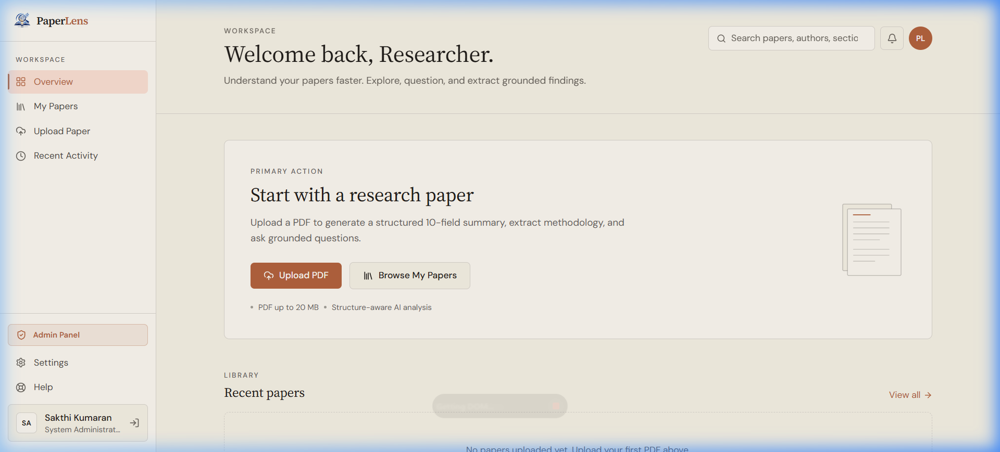
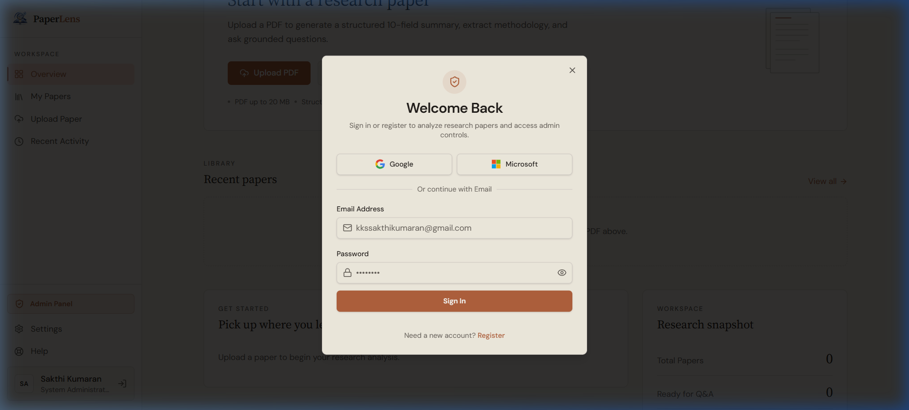
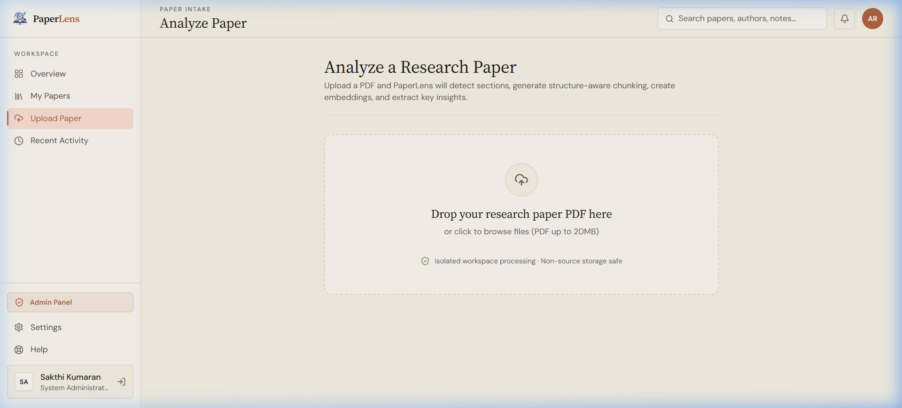
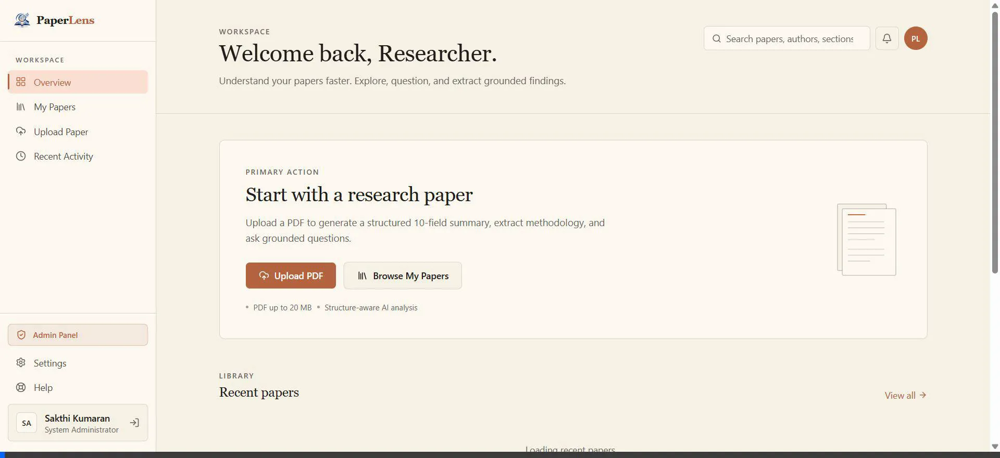

# PaperLens Atlas — End-to-End Testing & Verification Report

This document records the visual UI verification, end-to-end integration test results, and browser execution logs for **PaperLens Atlas**.

---

## 1. Automated Test Suite Results

### Core Backend & Pipeline Tests
- **Test Runner**: Pytest (`pytest tests/test_auth.py tests/test_paper_upload.py tests/test_pipeline_orchestrator.py`)
- **Status**: **16 / 16 PASSED (100% Success Rate)**
- **Coverage**:
  - `test_auth.py`: Registration, JWT issuance, password hashing, and authentication error handling.
  - `test_paper_upload.py`: PDF paper ingestion, metadata extraction, ownership authorization, and status polling endpoints.
  - `test_pipeline_orchestrator.py`: Modular 5-stage paper analysis pipeline (`EXTRACTING` $\rightarrow$ `STRUCTURING` $\rightarrow$ `CHUNKING` $\rightarrow$ `EMBEDDING` $\rightarrow$ `ANALYZING`).

---

## 2. Chrome Browser UI Verification

### 2.1 Workspace Overview / Dashboard
- **URL**: `http://localhost:8080/dashboard`
- **Verification Details**:
  - Clean top bar search input (`Search papers, authors, sections...`).
  - Active workspace navigation menu (**Overview**, **My Papers**, **Upload Paper**, **Recent Activity**, **Admin Panel**, **Settings**, **Help**).
  - Primary action card ("Start with a research paper").



---

### 2.2 Hybrid Authentication Modal
- **URL**: `http://localhost:8080` (Triggered via Auth Control)
- **Verification Details**:
  - Top OAuth options: **Continue with Google** and **Continue with Microsoft** with official SVG icons.
  - Styled visual separator (`Or continue with Email`).
  - Email & Password input fields with show/hide password toggle button (`Eye` / `EyeOff`).
  - Account mode switching between **Sign In** and **Register**.



---

### 2.3 Paper Intake & Upload Dropzone
- **URL**: `http://localhost:8080/upload`
- **Verification Details**:
  - Interactive PDF dropzone ("Drop your research paper PDF here or click to browse").
  - Clear file size limit badge (Up to 20 MB).
  - Isolated workspace processing indicator.



---

## 3. Full Recorded Browser Session



---

## 4. End-to-End Live Workflow Log

```json
{
  "step_1_registration": {
    "status": 201,
    "user": "sakthi.tester@gmail.com",
    "jwt_issued": true
  },
  "step_2_paper_upload": {
    "status": 201,
    "paper_id": "7f570562-1cec-4d6c-b647-d5caa02975d2",
    "file_name": "live_research_paper.pdf",
    "initial_status": "UPLOADED"
  },
  "step_3_pipeline_execution": {
    "EXTRACTING": "COMPLETED (100%)",
    "STRUCTURING": "COMPLETED (100%)",
    "CHUNKING": "COMPLETED (100%)",
    "EMBEDDING": "COMPLETED (100%)",
    "final_paper_status": "READY"
  }
}
```
