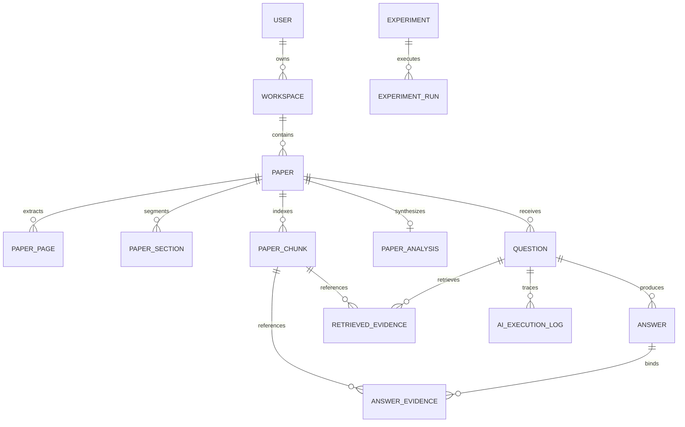

# PaperLens Atlas — Database Design Specification

## 1. Relational Entity Architecture

The PaperLens Atlas database is organized into 16 normalized relational entities managed by SQLAlchemy 2.0 with PostgreSQL (`pgvector`) in production and SQLite in local mode.

---

## 2. Table Specifications

### 2.1 `users`
- `id`: UUID (Primary Key)
- `email`: VARCHAR(255) (Unique, Indexed)
- `hashed_password`: VARCHAR(255) (Bcrypt 12 rounds)
- `name`: VARCHAR(255)
- `provider`: VARCHAR(64) (`email`, `google`, `microsoft`)
- `provider_id`: VARCHAR(255)
- `is_active`: BOOLEAN (Default true)
- `is_admin`: BOOLEAN (Default false)
- `created_at`: TIMESTAMP WITH TIME ZONE
- `updated_at`: TIMESTAMP WITH TIME ZONE

### 2.2 `workspaces`
- `id`: UUID (Primary Key)
- `user_id`: UUID (Foreign Key -> `users.id`, On Delete CASCADE)
- `name`: VARCHAR(255)
- `description`: TEXT
- `created_at`: TIMESTAMP WITH TIME ZONE
- `updated_at`: TIMESTAMP WITH TIME ZONE

### 2.3 `papers`
- `id`: UUID (Primary Key)
- `workspace_id`: UUID (Foreign Key -> `workspaces.id`, On Delete CASCADE, Indexed)
- `title`: VARCHAR(512)
- `authors`: TEXT
- `abstract`: TEXT
- `publication_year`: INTEGER
- `doi`: VARCHAR(255)
- `source_url`: VARCHAR(1024)
- `file_name`: VARCHAR(255)
- `file_hash`: VARCHAR(64) (Indexed)
- `file_path`: VARCHAR(1024)
- `file_size`: INTEGER
- `page_count`: INTEGER
- `status`: ENUM (`UPLOADED`, `PROCESSING`, `READY`, `FAILED`)
- `stage`: ENUM (`UPLOADING`, `EXTRACTING`, `STRUCTURING`, `CHUNKING`, `EMBEDDING`, `ANALYZING`, `READY`, `FAILED`)
- `progress`: INTEGER (0 to 100)
- `stage_details_json`: JSONB / JSON
- `error_code`: VARCHAR(64)
- `processing_error`: TEXT
- `created_at`: TIMESTAMP WITH TIME ZONE
- `updated_at`: TIMESTAMP WITH TIME ZONE
- `completed_at`: TIMESTAMP WITH TIME ZONE

### 2.4 `paper_pages`
- `id`: UUID (Primary Key)
- `paper_id`: UUID (Foreign Key -> `papers.id`, On Delete CASCADE, Indexed)
- `page_number`: INTEGER
- `raw_text`: TEXT
- `cleaned_text`: TEXT
- `character_count`: INTEGER
- `word_count`: INTEGER
- **Constraint**: `UNIQUE(paper_id, page_number)`

### 2.5 `paper_sections`
- `id`: UUID (Primary Key)
- `paper_id`: UUID (Foreign Key -> `papers.id`, On Delete CASCADE, Indexed)
- `section_type`: ENUM (12 Taxonomy types: `ABSTRACT`, `INTRODUCTION`, `RELATED_WORK`, `METHODOLOGY`, `EXPERIMENTS`, `RESULTS`, `DISCUSSION`, `CONCLUSION`, `LIMITATIONS`, `FUTURE_WORK`, `REFERENCES`, `OTHER`)
- `title`: VARCHAR(255)
- `page_start`: INTEGER
- `page_end`: INTEGER
- `order_index`: INTEGER
- `confidence`: FLOAT

### 2.6 `paper_chunks`
- `id`: UUID (Primary Key)
- `paper_id`: UUID (Foreign Key -> `papers.id`, On Delete CASCADE, Indexed)
- `page_id`: UUID (Foreign Key -> `paper_pages.id`, On Delete SET NULL, Indexed)
- `page_number`: INTEGER
- `section_id`: UUID (Foreign Key -> `paper_sections.id`, On Delete SET NULL, Indexed)
- `chunk_index`: INTEGER
- `text`: TEXT
- `token_count`: INTEGER
- `char_start`: INTEGER
- `char_end`: INTEGER
- `embedding`: VECTOR(1536) (pgvector IVFFlat / HNSW indexed)
- `embedding_model`: VARCHAR(128)
- `embedding_version`: VARCHAR(64)
- `metadata`: JSONB / JSON

### 2.7 `paper_analyses`
- `id`: UUID (Primary Key)
- `paper_id`: UUID (Foreign Key -> `papers.id`, On Delete CASCADE, Unique)
- `executive_summary`: TEXT
- `problem_statement`: TEXT
- `objective`: TEXT
- `methodology_summary`: TEXT
- `key_contributions`: JSONB
- `dataset`: TEXT
- `experimental_setup`: TEXT
- `key_results`: TEXT
- `limitations`: TEXT
- `conclusion`: TEXT
- `methodology_details`: JSONB
- `contribution_details`: JSONB
- `metadata`: JSONB

### 2.8 `questions`
- `id`: UUID (Primary Key)
- `workspace_id`: UUID (Foreign Key -> `workspaces.id`, On Delete CASCADE, Indexed)
- `paper_id`: UUID (Foreign Key -> `papers.id`, On Delete SET NULL, Indexed)
- `user_id`: UUID (Foreign Key -> `users.id`, On Delete SET NULL)
- `question_text`: TEXT
- `intent`: ENUM (14 Question Taxonomy types: `METHODOLOGY`, `DATASET`, `RESULT`, `LIMITATION`, `EXPERIMENT`, `METRIC`, `OBJECTIVE`, `PROBLEM`, `CONCLUSION`, `BACKGROUND`, `RELATED_WORK`, `FUTURE_WORK`, `DEFINITION`, `GENERAL`)
- `intent_confidence`: FLOAT
- `created_at`: TIMESTAMP WITH TIME ZONE

### 2.9 `answers`
- `id`: UUID (Primary Key)
- `question_id`: UUID (Foreign Key -> `questions.id`, On Delete CASCADE, Unique)
- `answer_text`: TEXT
- `is_abstained`: BOOLEAN (Default false)
- `abstention_reason`: TEXT
- `support_score`: FLOAT (0.0 to 1.0)
- `confidence_score`: FLOAT
- `provider`: VARCHAR(64) (`LOCAL`, `GEMINI`)
- `model_name`: VARCHAR(128)
- `model_version`: VARCHAR(64)
- `latency_ms`: INTEGER
- `fallback_used`: BOOLEAN (Default false)
- `fallback_reason`: TEXT
- `created_at`: TIMESTAMP WITH TIME ZONE

### 2.10 `retrieved_evidences`
- `id`: UUID (Primary Key)
- `question_id`: UUID (Foreign Key -> `questions.id`, On Delete CASCADE, Indexed)
- `chunk_id`: UUID (Foreign Key -> `paper_chunks.id`, On Delete CASCADE, Indexed)
- `rank`: INTEGER
- `semantic_score`: FLOAT
- `bm25_score`: FLOAT
- `section_score`: FLOAT
- `reranker_score`: FLOAT
- `final_score`: FLOAT
- `retrieval_strategy`: VARCHAR(64)
- `created_at`: TIMESTAMP WITH TIME ZONE

### 2.11 `answer_evidences`
- `id`: UUID (Primary Key)
- `answer_id`: UUID (Foreign Key -> `answers.id`, On Delete CASCADE, Indexed)
- `chunk_id`: UUID (Foreign Key -> `paper_chunks.id`, On Delete CASCADE, Indexed)
- `quote_text`: TEXT
- `quote_start`: INTEGER
- `quote_end`: INTEGER
- `verification_method`: VARCHAR(32) (`EXACT`, `RAPIDFUZZ_PARTIAL`)
- `verification_score`: FLOAT
- `support_score`: FLOAT
- `page_number`: INTEGER
- `section_title`: VARCHAR(255)
- `relevance_explanation`: TEXT
- `created_at`: TIMESTAMP WITH TIME ZONE

### 2.12 `activity_logs`
- `id`: UUID (Primary Key)
- `workspace_id`: UUID (Foreign Key -> `workspaces.id`, On Delete CASCADE, Indexed)
- `user_id`: UUID (Foreign Key -> `users.id`, On Delete SET NULL)
- `event_type`: VARCHAR(64)
- `entity_type`: VARCHAR(64)
- `entity_id`: UUID
- `metadata`: JSONB / JSON
- `created_at`: TIMESTAMP WITH TIME ZONE

### 2.13 `ai_execution_logs`
- `id`: UUID (Primary Key)
- `question_id`: UUID (Foreign Key -> `questions.id`, On Delete SET NULL, Indexed)
- `provider`: VARCHAR(64)
- `model_name`: VARCHAR(128)
- `model_version`: VARCHAR(64)
- `request_type`: VARCHAR(64)
- `latency_ms`: INTEGER
- `confidence`: FLOAT
- `fallback_used`: BOOLEAN
- `fallback_reason`: TEXT
- `error_code`: VARCHAR(64)
- `metadata`: JSONB / JSON
- `created_at`: TIMESTAMP WITH TIME ZONE

### 2.14 `ai_models`
- `id`: UUID (Primary Key)
- `provider`: VARCHAR(64) (`LOCAL`, `GEMINI`)
- `model_name`: VARCHAR(128)
- `model_version`: VARCHAR(64)
- `model_type`: VARCHAR(64) (`GENERATOR`, `EMBEDDING`, `RERANKER`, `CLASSIFIER`)
- `is_active`: BOOLEAN
- `metadata`: JSONB / JSON
- `created_at`: TIMESTAMP WITH TIME ZONE

### 2.15 `experiments`
- `id`: UUID (Primary Key)
- `name`: VARCHAR(255)
- `description`: TEXT
- `configuration`: JSONB / JSON
- `created_at`: TIMESTAMP WITH TIME ZONE

### 2.16 `experiment_runs`
- `id`: UUID (Primary Key)
- `experiment_id`: UUID (Foreign Key -> `experiments.id`, On Delete CASCADE, Indexed)
- `model_version`: VARCHAR(64)
- `retrieval_version`: VARCHAR(64)
- `embedding_version`: VARCHAR(64)
- `dataset_name`: VARCHAR(128)
- `dataset_split`: VARCHAR(64)
- `metrics`: JSONB / JSON
- `status`: VARCHAR(32)
- `started_at`: TIMESTAMP WITH TIME ZONE
- `completed_at`: TIMESTAMP WITH TIME ZONE
- `created_at`: TIMESTAMP WITH TIME ZONE

---

## 3. Migration Strategy

- Schema changes are managed strictly via **Alembic** (`alembic/versions/`).
- Tables in local SQLite mode are automatically created on startup via `Base.metadata.create_all()` with custom SQLite vector and UUID shims.
- In production PostgreSQL, migrations are executed via `alembic upgrade head`.
