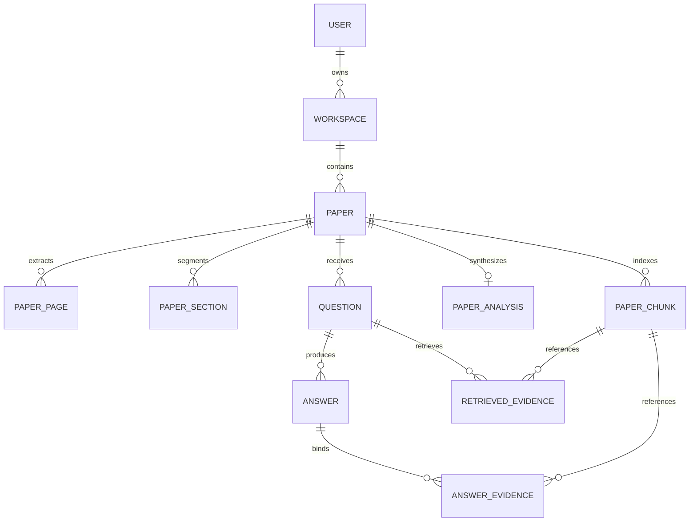

# PaperLens Atlas — Database Design Specification

## 1. Relational Entity Architecture

The PaperLens Atlas database is organized into 11 normalized relational entities managed by SQLAlchemy 2.0 with PostgreSQL (`pgvector`) in production and SQLite in local mode.

---

## 2. Table Specifications

### 2.1 `users`
- `id`: UUID (Primary Key)
- `email`: VARCHAR(255) (Unique, Indexed)
- `hashed_password`: VARCHAR(255) (Bcrypt 12 rounds)
- `name`: VARCHAR(255)
- `is_active`: BOOLEAN (Default true)
- `is_admin`: BOOLEAN (Default false)
- `created_at`: TIMESTAMP WITH TIME ZONE
- `updated_at`: TIMESTAMP WITH TIME ZONE

### 2.2 `workspaces`
- `id`: UUID (Primary Key)
- `user_id`: UUID (Foreign Key -> `users.id`, On Delete CASCADE)
- `name`: VARCHAR(255)
- `slug`: VARCHAR(255) (Unique per user)
- `created_at`: TIMESTAMP WITH TIME ZONE

### 2.3 `papers`
- `id`: UUID (Primary Key)
- `workspace_id`: UUID (Foreign Key -> `workspaces.id`, On Delete CASCADE, Indexed)
- `title`: VARCHAR(512)
- `authors`: TEXT
- `abstract`: TEXT
- `page_count`: INTEGER
- `file_name`: VARCHAR(255)
- `file_path`: VARCHAR(512)
- `file_size`: BIGINT
- `status`: ENUM (`UPLOADED`, `PROCESSING`, `READY`, `FAILED`)
- `stage`: ENUM (`UPLOADING`, `EXTRACTING`, `STRUCTURING`, `CHUNKING`, `EMBEDDING`, `ANALYZING`, `READY`, `FAILED`)
- `progress`: INTEGER (0 to 100)
- `stage_details`: JSONB
- `processing_error`: TEXT
- `created_at`: TIMESTAMP WITH TIME ZONE
- `updated_at`: TIMESTAMP WITH TIME ZONE

### 2.4 `paper_pages`
- `id`: UUID (Primary Key)
- `paper_id`: UUID (Foreign Key -> `papers.id`, On Delete CASCADE, Indexed)
- `page_number`: INTEGER
- `raw_text`: TEXT
- `cleaned_text`: TEXT
- `character_count`: INTEGER
- `word_count`: INTEGER
- **Constraint**: `UNIQUE(paper_id, page_number)`

### 2.5 `paper_sections`
- `id`: UUID (Primary Key)
- `paper_id`: UUID (Foreign Key -> `papers.id`, On Delete CASCADE, Indexed)
- `section_type`: ENUM (12 Taxonomy types: `ABSTRACT`, `METHODOLOGY`, `RESULTS`, etc.)
- `title`: VARCHAR(255)
- `page_start`: INTEGER
- `page_end`: INTEGER
- `sequence_order`: INTEGER
- `confidence`: FLOAT

### 2.6 `paper_chunks`
- `id`: UUID (Primary Key)
- `paper_id`: UUID (Foreign Key -> `papers.id`, On Delete CASCADE, Indexed)
- `section_id`: UUID (Foreign Key -> `paper_sections.id`, On Delete SET NULL, Indexed)
- `page_number`: INTEGER
- `chunk_index`: INTEGER
- `content`: TEXT
- `token_count`: INTEGER
- `embedding`: VECTOR(1536) (pgvector IVFFlat / HNSW indexed)

### 2.7 `paper_analysis`
- `id`: UUID (Primary Key)
- `paper_id`: UUID (Foreign Key -> `papers.id`, On Delete CASCADE, Unique)
- `executive_summary`: TEXT
- `problem_statement`: TEXT
- `objective`: TEXT
- `methodology_summary`: TEXT
- `key_contributions`: JSONB
- `dataset`: TEXT
- `experimental_setup`: TEXT
- `key_results`: TEXT
- `limitations`: TEXT
- `conclusion`: TEXT
- `methodology_details`: JSONB
- `contribution_details`: JSONB

### 2.8 `questions`
- `id`: UUID (Primary Key)
- `paper_id`: UUID (Foreign Key -> `papers.id`, On Delete CASCADE, Indexed)
- `user_id`: UUID (Foreign Key -> `users.id`, On Delete SET NULL)
- `question_text`: TEXT
- `intent`: ENUM (14 Question Taxonomy types)
- `intent_confidence`: FLOAT
- `created_at`: TIMESTAMP WITH TIME ZONE

### 2.9 `answers`
- `id`: UUID (Primary Key)
- `question_id`: UUID (Foreign Key -> `questions.id`, On Delete CASCADE, Unique)
- `answer_text`: TEXT
- `abstained`: BOOLEAN (Default false)
- `support_score`: FLOAT (0.0 to 1.0)
- `provider`: VARCHAR(64) (`LOCAL`, `GEMINI`)
- `model_name`: VARCHAR(128)
- `latency_ms`: INTEGER
- `fallback_used`: BOOLEAN (Default false)
- `fallback_reason`: TEXT

### 2.10 `retrieved_evidence`
- `id`: UUID (Primary Key)
- `question_id`: UUID (Foreign Key -> `questions.id`, On Delete CASCADE, Indexed)
- `chunk_id`: UUID (Foreign Key -> `paper_chunks.id`, On Delete CASCADE)
- `rank`: INTEGER
- `semantic_score`: FLOAT
- `bm25_score`: FLOAT
- `section_score`: FLOAT
- `final_score`: FLOAT

### 2.11 `answer_evidence`
- `id`: UUID (Primary Key)
- `answer_id`: UUID (Foreign Key -> `answers.id`, On Delete CASCADE, Indexed)
- `chunk_id`: UUID (Foreign Key -> `paper_chunks.id`, On Delete CASCADE, Indexed)
- `quote_text`: TEXT
- `verification_method`: VARCHAR(32) (`EXACT`, `RAPIDFUZZ_PARTIAL`)
- `verification_score`: FLOAT
- `page_number`: INTEGER
- `section_title`: VARCHAR(255)

---

## 3. Migration Strategy

- Schema changes are managed strictly via **Alembic** (`alembic/versions/`).
- Tables in local SQLite mode are automatically created on startup via `Base.metadata.create_all()` with custom SQLite vector and UUID shims.
- In production PostgreSQL, migrations are executed via `alembic upgrade head`.
